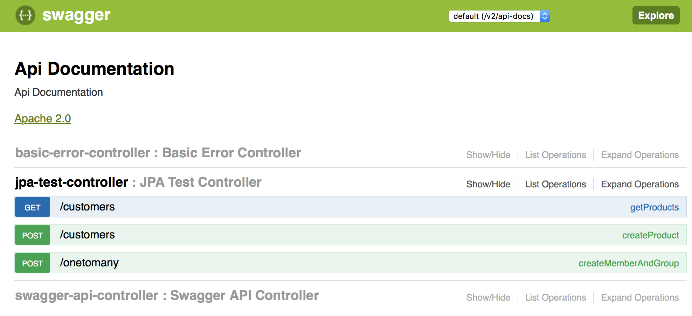
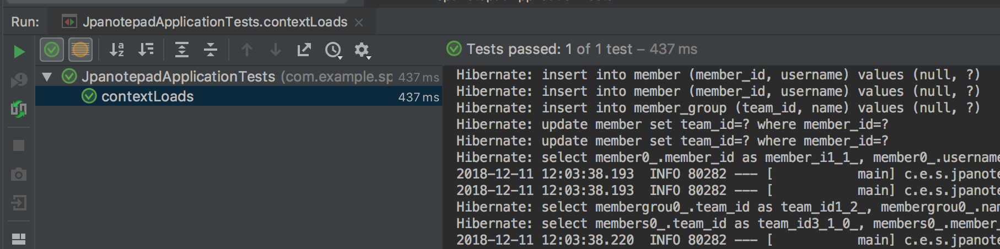
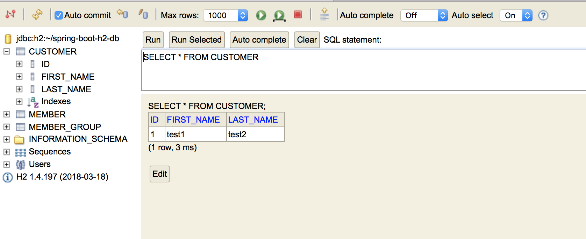
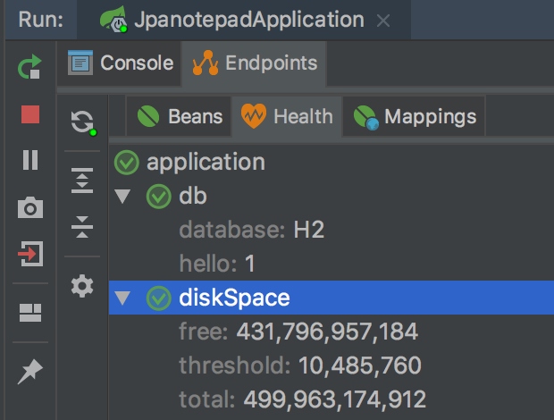

# JPA NOTEPAD

You can easily practice JPA with StandAlone

JPA has been configured to make shoveling faster and faster.

## Setting
- Import Project from InteliJ or Exist Open Source (Maven)
- Wait until you get all the libraries automatically.
- RUN and DEBUG can be activated automatically (automatic activation by detecting SPRING BOOT)
- If not enabled, it can be executed manually with mvn spring-boot: run command
- Default Url -  [http://localhost:8080/](http://localhost:8080/)

## API TEST

Create APIs in the controler to document and test the stack APIs

url: [http://localhost:8080/swagger-ui.html](http://localhost:8080/swagger-ui.html)

or

DBTest through unit testing

## H2 : Built-in Disk DB
SQL statements can be used to check values, or to perform additional, native query exercises.

- url : http://localhost:8080/h2
- jdbc : jdbc:h2:~/spring-boot-h2-db

## Concept
- JPATestService.java: You can test the EntityManager.
- JPATestController.java: Rest it to be tested by Swagger
- entity: Define an entity that you want to practice. The table is automatically generated at the next start-up.

## Actuator : Monitor your ap
- [http://localhost:8081/info](http://localhost:8081/info)

## Config : application.properties

    # Based on the Java file defined in the entity, the table is automatically created every time the application is started (initialization)
    spring.jpa.hibernate.ddl-auto = create
    
    # You can see the SQL statements that ORM calls in the debug log window.
    spring.jpa.show-sql = true
    
    # You can run the SQL Web utility to execute SQL statements.
    spring.h2.console.path = / h2
    spring.h2.console.enabled = true
    
